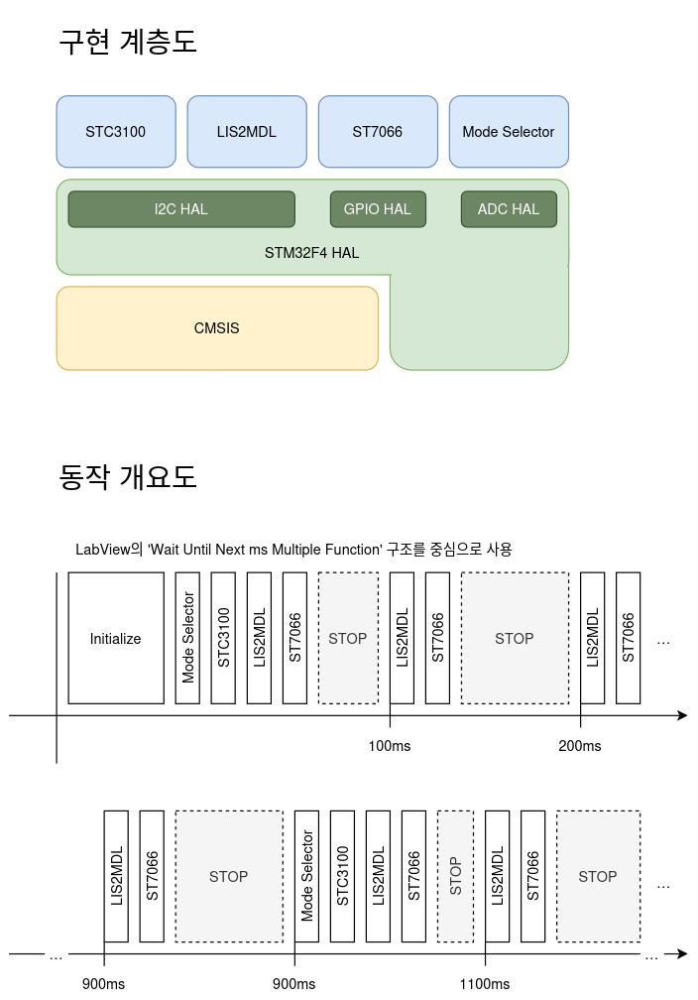
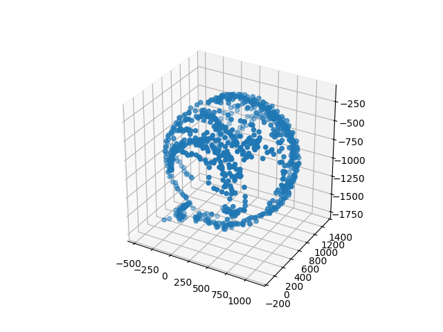
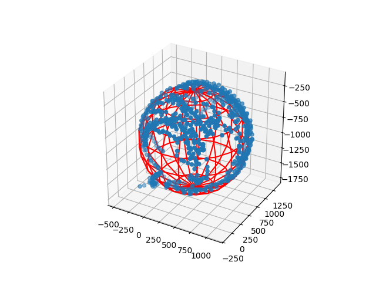
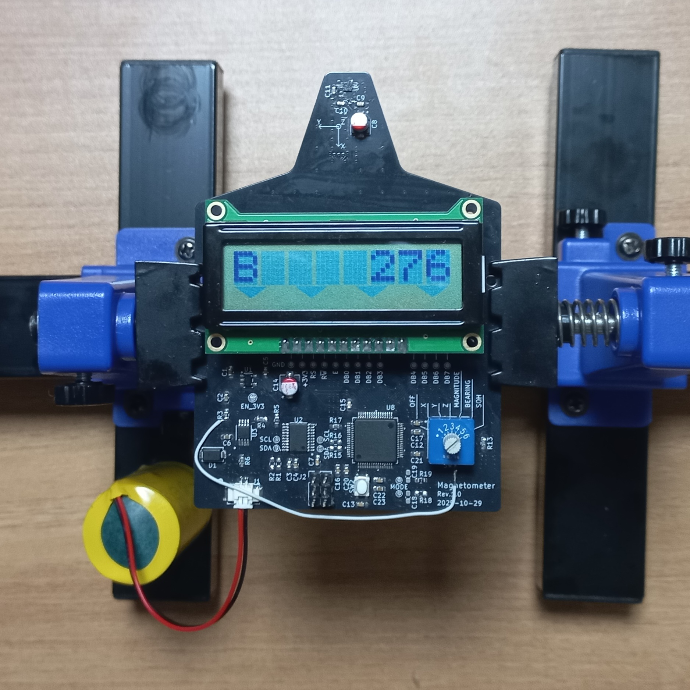
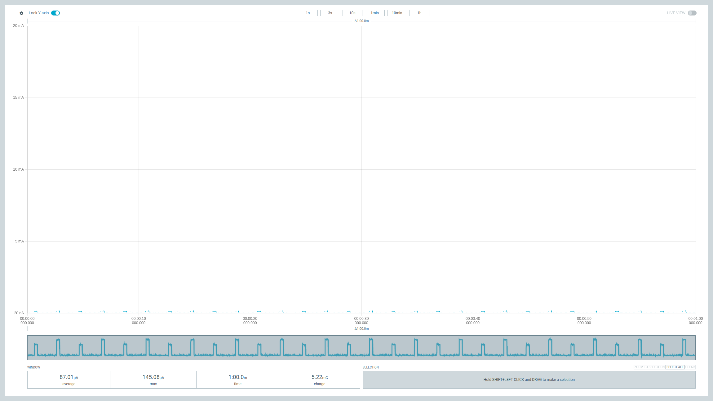
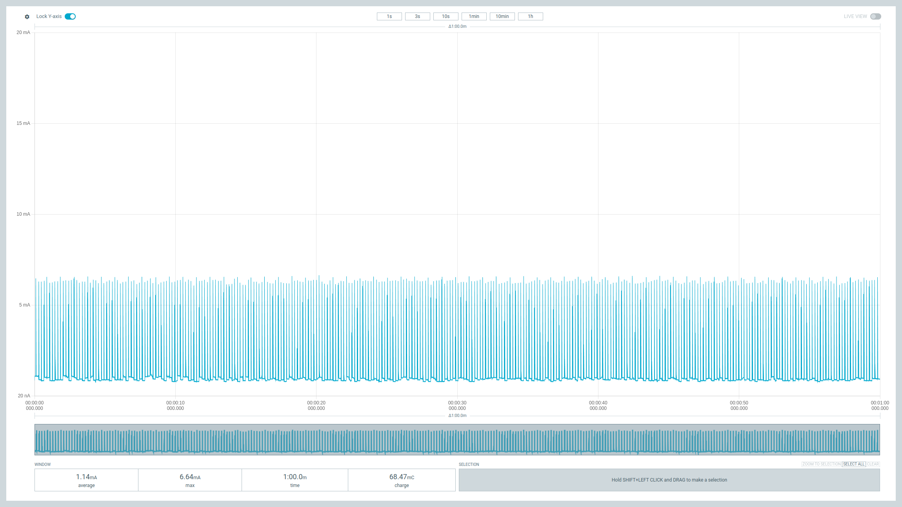
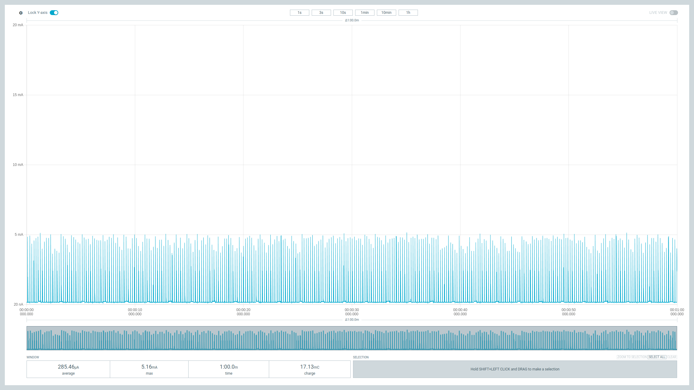

## 요구사항
### 기능
- ~~전원 온/오프~~ (모드 설정과 통합됨)
- 모드 설정 (스위치로 제어)
  - 전원 오프
  - 자기선속 계측
    - 크기
    - X 성분
    - Y 성분
    - Z 성분
    - ~~Temperature~~ (다른 기능으로 대체)
    - 방향 (나침반)
  - SOH (배터리 사용량 표시)
- ~~Status Indicator~~ (전류 소모상 배제)
  - ~~Power Good (transposition?)~~
  - ~~Battery Low~~
- 트리머 저항
  - ~~홀효과 센서 보정~~
  - LCD 백라이트 제어 (필요 시 추가 가능)
- 캐릭터 LCD
  - reflective 타입의 LCD로도 충분할 것으로 판단
  - 총 3개의 LCD 대응 (같은 LCD 드라이버를 사용하고 있어 단일 펌웨어로 대응)

### 목표 전력 소모와 작동 시간
- 평균 970 uA 이하
- 8500mAh 3.6V LiSOCl2 배터리
- 지속 사용 기준 약 1년(365일)

## 구현
### 
### 펌웨어 구조

### Least-squares 방법을 통한 센서 오프셋 보정
#### 측정 샘플

#### least-squares 방법으로 구한 센서 오프셋과 지자기장

## 결과물

## 측정
### 대기 상태 (전원 오프)

### 1분 사용 (NHD-0108HZ-FSW-GBW 사용)

### 1분 사용 (LCD 제외)

## 평가
- 원래 목표했던 약 970uA의 전력 소모를 초과하여 1.14mA로 측정되었지만 초기 계획했던 "NHD-0108BZ-RN-YBW-33V" 모델의 LCD를 사용하면 목표 전류 소모를 달성할 것으로 예상
- 8500mAh 배터리가 생각보다 커서 5800mAh C 배터리로 변경으로 목표 전류 소모 기준 약 249일 사용 가능
- 배터리 컷오프 고려 필요
- 센서 오차 보정을 통해 꽤나 그럴듯한 나침반 기능을 만들었으나 예상보다 큰 드리프트가 발생하여 원인 파악이 필요
- 결과적으로 3종류의 LCD를 대응할 필요가 없음
- 모드 선택을 ADC를 통해 구현했지만 실재로는 남은 GPIO를 사용해도 충분함
- 개발환경을 독립적으로 구성하려 했지만 결국 HAL 이용을 위해 STM32CubeIDE에 종속된 것이 아쉬움
  - 최종적으로 STM32CubeMX 기능으로 초기 설정 코드만 생성하고 이후는 ARM GCC 툴체인으로 대체
- 배터리 전류 측정 IC가 동작하는 것에 비해 소모 전력이 작음을 체감, 이후 다른 배터리 사용 기기에 적용하는 것 고려
